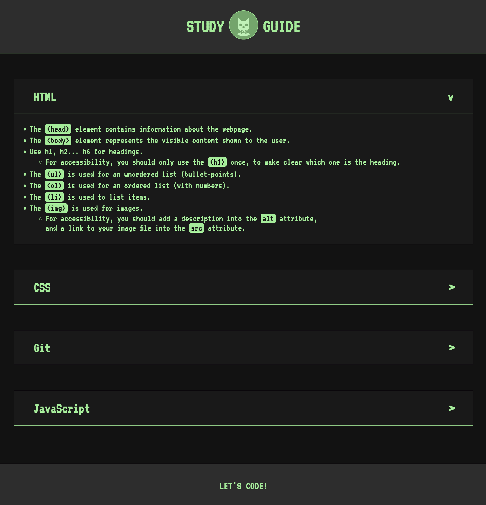

# Full-Stack Study Guide
The ultimate study guide for BootCamp students in full-stack. 

## **ABOUT THE PROJECT**
**Overview**

To code, you don't need to memorize information, but know when, how and where to look for it. In this guide you'll find shortcups to things you want to know or remember without having to google them. You'll find references everywhere. Good luck creating!

## Table of Contents
- [Resources](#resources)
- [Usage](#usage)
- [Get Started](#get-started)
- [License](#license)
- [Credits](#credits)

## Resources
* For the HTML:
    * Structure.
    * Favicon.
    * Forced dark mode.
    * Google fonts.
* For the CSS:
    * Intuitive classes and appealing design to make you feel inside the grid.
    * :hover and transitions are used to animate elements across the site.
* For JavaScript
    * Some console logs to demonstrate:
        * Conditional ifs.
        * For loops.

## Usage
The site is easy and intuitive to use. The clickable elements reveal when you hover over them to know with what you can interact and find more info.

After loading the website, you'll find that after hovering over any subject, a cheat-sheet will open. You'll find plenty of links scattered around to open further references about each topic.

* Each piece literal code is lightened in green.  

## Get Started
[Click here](https://rod-freedom.github.io/PreworkSG_2.0/), and put that hands to code!

## License
This project is under an [MIT License](https://github.com/Rod-Freedom/PreworkSG_2.0/blob/main/LICENSE). See the LICENSE file for more details.

## Credits

All the code was created from scratch by [Rod's Freedom.](https://github.com/Rod-Freedom)